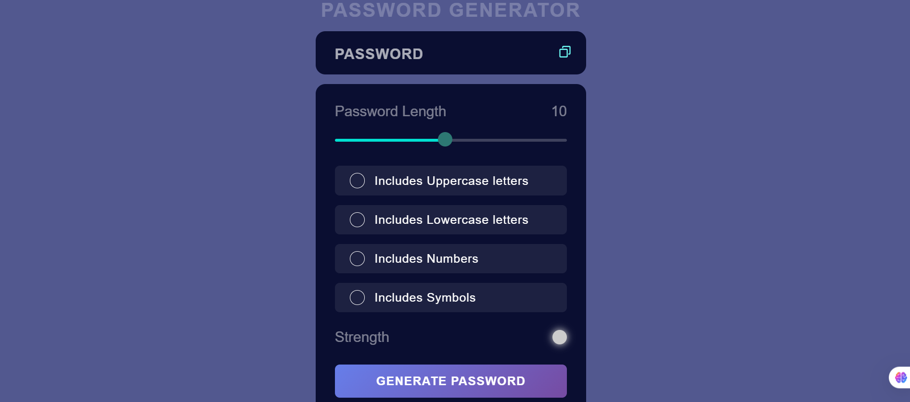

# Password Generator Tool
This is a simple yet powerful Password Generator tool built using HTML, CSS, and JavaScript. It allows users to create strong passwords based on their preferences, including uppercase and lowercase letters, numbers, and symbols. Additionally, the tool visually indicates the strength of the generated password.

## Features
- Generate passwords up to 20 characters in length
- Include uppercase letters, lowercase letters, numbers, and symbols
- Dynamic password strength indicator using color changes
- User-friendly interface with interactive elements

## How to Use
1. Adjust the password length using the slider.
2. Select the desired character types (uppercase, lowercase, numbers, symbols).
3. Click the "Generate Password" button.
4. Copy the generated password using the copy icon.

## Technologies Used
- **HTML**: Structure of the tool
- **CSS**: Styling and layout
- **JavaScript**: Password generation logic and interactivity
